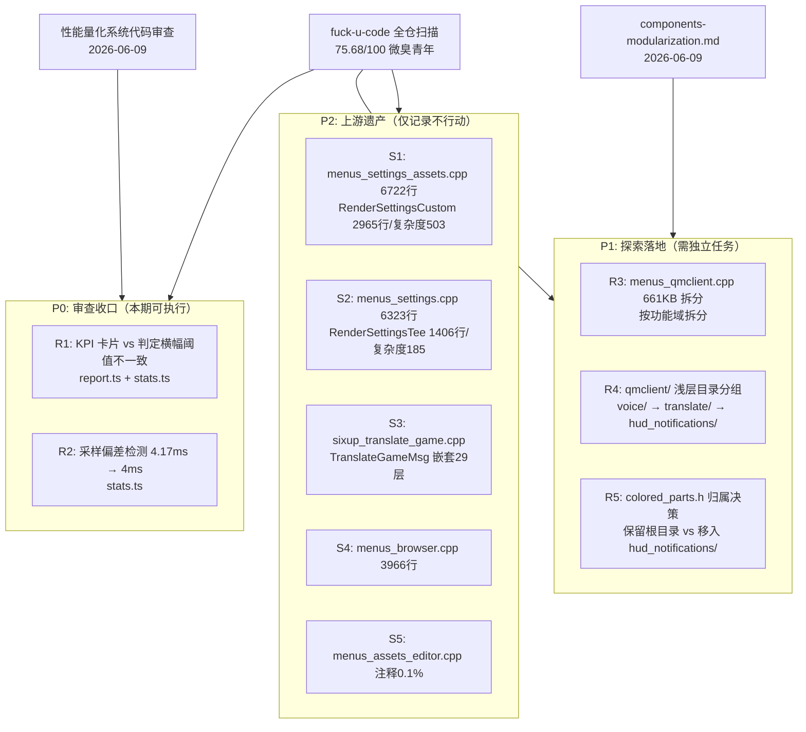

## 速答

基于 fuck-u-code 全仓扫描（糟糕指数 75.68/100，"微臭青年"）和已有探索/审查报告交叉分析：**扫描出的 Top 5 问题文件全部是 DDNet 上游遗产，不应触碰。** QmClient 自有代码中真正值得重构的点分为三层：

- **P0 审查收口（2 项）**：perf 系统的阈值不一致和采样偏差检测，改动小、有测试保护、影响用户可见的报表正确性。
- **P1 探索落地（3 项）**：`menus_qmclient.cpp` 661KB 拆分、`qmclient/` 浅层目录分组（voice/translate/hud_notifications）、`colored_parts.h` 归属决策。
- **P2 上游遗产（5 项）**：`menus_settings.cpp`、`menus_browser.cpp`、`menus_settings_assets.cpp`、`sixup_translate_game.cpp`、`menus_assets_editor.cpp` — 仅记录不行动。

优先级公式：影响面 × 修复成本 ÷ 风险。P0 两项是典型高 ROI 重构（2 行改动，有测试保护），P1 需要独立任务/分支推进，P2 不在 QmClient 补丁范围内。

---

## 1. fuck-u-code 扫描结果分层

### 1.1 总体评分

| 指标 | 值 |
|---|---|
| 糟糕指数 | 75.68 / 100 |
| 等级 | 😐 微臭青年 |
| 总代码行 | 636,380 |
| 总文件数 | 3,113 |
| 扫描耗时 | 13,588ms |

### 1.2 指标雷达

| 指标 | 评分 | 状态 | 解读 |
|---|---:|---:|---|
| 循环复杂度 | 5.12% | ✓✓ | 大部分函数复杂度可控 |
| 认知复杂度 | 5.16% | ✓✓ | 代码理解成本整体较低 |
| 嵌套深度 | 4.93% | ✓✓ | 深层嵌套集中在少数文件 |
| 函数长度 | 2.98% | ✓✓ | 平均函数长度合理 |
| 文件长度 | 4.84% | ✓✓ | 巨型文件是离群值 |
| 参数数量 | 4.01% | ✓✓ | 参数传递节制 |
| 代码重复 | 1.47% | ✓✓ | DRY 做得好 |
| 结构分析 | 3.24% | ✓✓ | 模块结构较清晰 |
| 错误处理 | 2.89% | ✓✓ | 错误路径处理规范 |
| **注释比例** | **68.30%** | ⚠ | 拖分最多的单项 |
| 命名规范 | 29.22% | ✓ | 混合命名风格（历史遗留） |

### 1.3 Top 5 问题文件归属判断

| # | 文件 | 指数 | 归属 | 当前分支改动？ | 可重构？ | 理由 |
|---|------|-----|------|:---:|:---:|------|
| 1 | `menus_settings.cpp` | 65.95 | DDNet 上游 | ✅ 有 | ⚠️ | 仅限局部收口，不能做大改 |
| 2 | `menus_browser.cpp` | 64.55 | DDNet 上游 | ❌ 无 | ❌ | QmClient 补丁边界外 |
| 3 | `menus_settings_assets.cpp` | 64.53 | DDNet 上游 | ❌ 无 | ❌ | QmClient 补丁边界外 |
| 4 | `sixup_translate_game.cpp` | 62.75 | DDNet 上游 | ❌ 无 | ❌ | QmClient 补丁边界外 |
| 5 | `menus_assets_editor.cpp` | 62.51 | DDNet 上游 | ❌ 无 | ❌ | QmClient 补丁边界外 |

**关键结论：fuck-u-code 的 Top 5 全部是 DDNet 上游遗产。** DDNet 的菜单系统以巨型 Render 函数著称——`RenderSettingsCustom` 单函数 2965 行/复杂度 503/嵌套 13 层，`TranslateGameMsg` 嵌套 29 层。这些是上游自身的设计选择，QmClient 的补丁策略正确地保持了"不改上游核心、只在 qmclient/ 下做增量"的边界。工具扫描出的问题不一定都值得修——要结合项目边界判断。

---

## 2. 关键证据

### 2.1 P0: 审查收口（本期可执行）

| # | 结论 | 证据 | 位置 |
|---|------|------|------|
| R1 | KPI 卡片阈值与判定横幅阈值使用不同截止值，可能导致 KPI 显示 "WARN" 而判定横幅显示 "PASS" | 审查报告 Finding 1：`report.ts` 章节中 KPI 卡片和判定横幅从不同变量读取阈值 | `qmclient_scripts/perf/lib/report.ts:269-270` vs `stats.ts:493-496` |
| R2 | `isSamplingBiased` 使用 4.17ms 而非系统实际默认 4ms，偏差检测可能漏报 | 审查报告 Finding 2：硬编码值与 `qm_perf_frame_budget_ms` 默认值不一致 | `qmclient_scripts/perf/lib/stats.ts:81` |

### 2.2 P1: 探索落地（需独立任务）

| # | 结论 | 证据 | 位置 |
|---|------|------|------|
| R3 | `menus_qmclient.cpp` 661KB 单文件混合了多个功能域，是 QmClient 代码质量的最大单一瓶颈 | `components-modularization.md` #9 已明确指出这是独立议题；fuck-u-code 的扫描器可能因文件过大而跳过了该文件的详细分析 | `src/game/client/components/qmclient/menus_qmclient.cpp` |
| R4 | `qmclient/` 目录平铺 55 文件，`voice/`、`translate/`、`hud_notifications/` 已有清晰的内部依赖边界，适合浅层目录分组 | `components-modularization.md` P0 候选：voice（7 文件闭合集群）、translate（6 文件入口/解析分离）、hud_notifications（9 文件但 colored_parts 需单独判断） | `src/game/client/components/qmclient/` |
| R5 | `colored_parts.h` 同时被 `hud_notifications`、`chat.cpp`、`console.cpp` 使用，归属不明 | `components-modularization.md` 未决问题：如果它是 chat/console 共享渲染工具，不应移入 hud_notifications/ | `src/game/client/components/qmclient/colored_parts.h` |

### 2.3 P2: 上游遗产（仅记录不行动）

| # | 结论 | 证据 | 位置 |
|---|------|------|------|
| S1 | `RenderSettingsCustom` 是仓库中复杂度最高的单一函数（2965 行，循环复杂度 503，认知复杂度 529，嵌套 13 层） | fuck-u-code 扫描报告 #3 | `src/game/client/components/menus_settings_assets.cpp:3663-6627` |
| S2 | `RenderSettingsTee` 1406 行，循环复杂度 185，认知复杂度 195 | fuck-u-code 扫描报告 #1 | `src/game/client/components/menus_settings.cpp:1187-2592` |
| S3 | `TranslateGameMsg` 嵌套深度 29 层，是整个仓库嵌套最深的函数 | fuck-u-code 扫描报告 #4 | `src/game/client/components/sixup_translate_game.cpp:175-782` |
| S4 | `RenderServerbrowserServerList` 嵌套 12 层，`RenderServerbrowserFriends` 830 行/复杂度 118 | fuck-u-code 扫描报告 #2 | `src/game/client/components/menus_browser.cpp:439-1064` |
| S5 | `menus_assets_editor.cpp` 注释覆盖率仅 0.14%（3 行注释 / 2203 行代码），是仓库中注释最稀疏的非生成文件 | fuck-u-code 扫描报告 #5 | `src/game/client/components/menus_assets_editor.cpp` |

---

## 3. 分项重构判断

### 3.1 R1 + R2: 审查收口（P0）

**可执行性：高。** 两项都在 `qmclient_scripts/perf/` 下，属于当前分支的改动范围。改动规模极小（各 1-2 行），有 TypeScript 测试套件保护，不涉及 C++ 编译。

**为什么值得做：**
- R1 直接影响报表的用户可信度——如果同一指标在不同位置显示矛盾的判定，用户会怀疑整个量化系统的正确性。
- R2 可能导致采样偏差漏报，使得性能分析报表漏掉真实的帧时间问题。

**为什么现在不做：** 用户要求先落文档不执行。这两项应该在下一次 perf 系统改动时优先收口。

### 3.2 R3: menus_qmclient.cpp 拆分（P1）

**可执行性：中。** 661KB 单文件是 QmClient 代码质量的最大单一瓶颈，但拆分风险高。

**拆分策略建议：**
- 遵循 DDNet 现有模式（`menus_settings.cpp` → `menus_settings_assets.cpp` 等），不做抽象层
- 按功能域切分：脚本治理面板、翻译 UI 设置、QmClient 设置入口、Axiom 相关 UI
- 每个拆分独立提交，保持 CMenus 的方法分发不变

**不建议混入 axiom-script-governance 分支。** 当前分支的焦点是 Axiom 自动登录与脚本治理，不应夹带大体积文件拆分。

### 3.3 R4: qmclient/ 浅层目录分组（P1）

**可执行性：中。** `components-modularization.md` 已提供了详细的迁移顺序和 include 路径策略，但需要独立验证 CMake 同步、`gameclient.h` include 更新和测试路径修正。

**推荐顺序：**
1. `voice/` — 7 文件，内部依赖闭合，风险最低
2. `translate/` — 6 文件，入口/解析边界清晰
3. `hud_notifications/` — 先解决 R5 `colored_parts.h` 归属

### 3.4 R5: colored_parts.h 归属决策（P1）

**可执行性：高。** 只是一次 include 路径整理，但需要先确认语义归属。

**需要回答的问题：** `colored_parts.h` 是 HUD 通知系统的专属显示工具，还是 chat/console 的共享渲染工具？如果是前者，移入 `hud_notifications/`；如果是后者，保留 `qmclient/` 根目录。

### 3.5 S1-S5: 上游遗产（P2）

**不行动。** 这些文件属于 DDNet 上游。即使它们的指标极度糟糕（嵌套 29 层、单函数 2965 行），也不在 QmClient 的补丁边界内。

**例外：** 如果上游 DDNet 自身对这些文件做了重构，QmClient 在合并上游时应跟踪适配。

---

## 4. 探索范围

- **逐文件核验：**
  - `qmclient_scripts/perf/lib/report.ts` — R1 阈值不一致的具体代码
  - `qmclient_scripts/perf/lib/stats.ts` — R1 判定阈值 + R2 采样偏差检测
  - `src/game/client/components/qmclient/menus_qmclient.cpp` — R3 文件大小和功能域分布
  - `src/game/client/components/qmclient/` — R4 目录平铺现状
  - `src/game/client/components/qmclient/colored_parts.h` — R5 include 引用链
- **使用 CodeGraph 查看：** `qmclient/` 目录文件清单、`colored_parts.h` 引用者
- **参考已有文档：**
  - `docs/superpowers/explore/components-modularization.md` (active, 2026-06-09)
  - `docs/superpowers/reviews/2026-06-09-性能量化系统代码审查.md` (active, 2026-06-09)
  - `docs/superpowers/explore/2026-05-27-DDNet菜单UI规范探索.md` (partial-outdated, 2026-05-27)
- **使用工具：** fuck-u-code 全仓扫描（已执行）、已有审查/探索报告交叉分析
- **跳过：**
  - 上游 DDNet 菜单文件的实际代码重构
  - 目录移动或文件拆分的实际执行
  - P1 项目的具体实现计划（仅做可行性判断）

---

## 5. 置信度说明

**confidence: medium**

- P0 两项来自已执行的代码审查，有具体代码位置和确认的严重级别，置信度高。
- P1 三项来自 2026-06-09 的 `components-modularization.md` 探索，已交叉验证过 CMake、gameclient.h 和测试 include 引用，足以支撑"值得做"的判断。但未执行实际迁移，不能作为实施计划。
- P2 来自 fuck-u-code 自动扫描，工具分析可能遗漏上下文（如数据文件被误判为代码），且扫描器标记的命名/注释问题需要人工确认。但 Top 5 文件的规模类指标（行数、复杂度、嵌套深度）是客观测量，置信度高。
- 整体判断"不值得大动干戈"的结论置信度高——因为 Top 5 全是上游代码这个事实是确定的，且项目规则明确禁止修改它们。

---

## 6. 未决问题

- R5: `colored_parts.h` 是否应作为 HUD notification 内部工具，还是继续作为 chat/console 共享渲染工具保留根目录？
- R3: `menus_qmclient.cpp` 后续拆分是否要采用 `qmclient/menus/` 目录，还是沿用 `components/menus_*` 的上游模式？
- 上游 DDNet 是否已有对 `menus_settings*.cpp` 等巨型文件的官方重构计划？如果有，QmClient 应在合并时跟踪适配而非自行改造。

---

## 7. 相关文档

- `docs/superpowers/explore/components-modularization.md` — QmClient 组件目录模块化探索（active, 2026-06-09）
- `docs/superpowers/explore/2026-05-27-DDNet菜单UI规范探索.md` — 菜单 UI 规范与代码入口（partial-outdated, 2026-05-27）
- `docs/superpowers/explore/2026-05-26-设置页性能修复概要.md` — 设置页性能修复执行清单（outdated, 2026-05-26）
- `docs/superpowers/reviews/2026-06-09-性能量化系统代码审查.md` — perf 系统审查报告（active, 2026-06-09）
- `docs/ai-workflow/ddnet-development.md` — DDNet/QmClient 补丁范围约束

---

## 8. 后续建议

1. **近期：** 在下一轮 perf 系统改动时优先收口 R1 + R2（改动极小，直接在改动中附带修正即可，无需独立 PR）。
2. **中期：** 为 R3（menus_qmclient.cpp 拆分）和 R4（qmclient/ 目录分组）各建一份独立 superpowers plan，在专门的 feature 分支上推进，不要混入功能分支。
3. **长期：** 跟踪上游 DDNet 对巨型菜单文件的官方重构动向，在合并上游时适配而不是自行改造。
4. **工具链：** 建议在 gate 流程中增加 fuck-u-code 或类似复杂度扫描，但配置为只报告 `src/game/client/components/qmclient/` 和 `qmclient_scripts/` 等 QmClient 自有目录，避免上游文件噪声淹没真正的问题。
